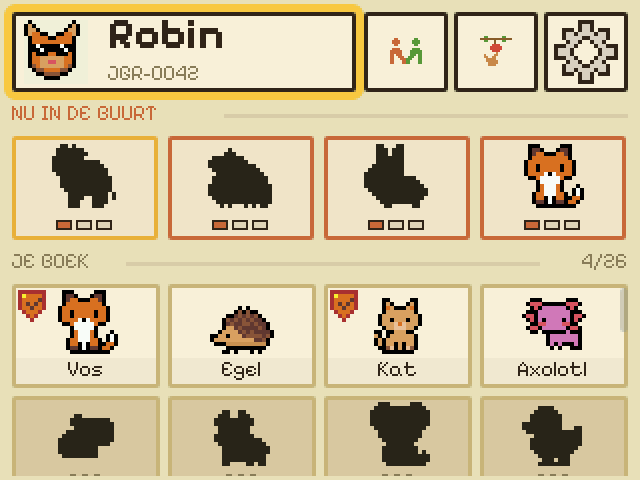

# Foxhunt 🦊

A playful radio fox-hunting (ARDF) game for the **Fri3d Camp 2026 badge**.
Players track hidden LoRa beacons with a directional antenna and collect the
creatures they find in a Pokédex-style book.

<p align="center">
  
</p>

**Download:** [Get Foxhunt on BadgeHub](https://badgehub.eu/page/project/com.enigmeta.foxhunt)

Foxhunt combines a Dutch-language interface, original pixel art, and two ways
to play. It runs from the same source on the ESP32-S3 badge and in the macOS SDL
emulator, using MicroPythonOS and LVGL.

## How it works

- **Jagers** use a LoRa antenna to follow signal strength, find the four
  physical foxes around the camp, and earn points.
- **Verzamelaars** play without an antenna. They collect creatures from other
  players and care for their own book, with separate scoring.
- A **LoRa bridge** confirms finds in the field and relays them to the cloud
  scoreboard over Wi-Fi.
- The badge app keeps the game approachable with a warm pixel-art interface,
  sound, LEDs, and keyboard-friendly navigation in the emulator.

## Glossary

| Term | Meaning |
| --- | --- |
| Player | Anyone playing Foxhunt. |
| Jager (hunter) | A player with a LoRa antenna who tracks foxes and earns points for finds. |
| Verzamelaar (collector) | A player without an antenna who collects creatures from jagers and cares for them. |
| Fox | One of four fixed devices in the field that transmits a LoRa beacon. |
| Bridge relay | Hardware that acknowledges finds over LoRa and relays them to the server over Wi-Fi. |
| Cloud server | The service that tracks players, collections, and scores. |

## Layout

```
com.enigmeta.foxhunt/        # the MicroPythonOS app (the thing that ships)
  MANIFEST.JSON
  assets/                    # Python; this directory is on sys.path at runtime
    foxhunt.py               # entry point and initial route
    screens_*.py             # onboarding, system, hunt, and care flows
    creatures.py / pet.py    # roster and care rules
    companion.py             # player avatar model and renderer
    registrar.py             # optional cloud API client
    *_radio.py / lora.py     # LoRa, ESP-NOW, and Wi-Fi game transports
    art.py / ui.py           # drawing, shared widgets, fonts, and colours
    store.py                 # local persistence
    sprites.bin / atlas.py   # generated pixel-art atlas and index
  icon_64x64.png
artwork/                     # editable pixel-art sources
server/                      # Cloudflare Worker, D1 schema, and public website
scripts/                     # emulator, packaging, capture, and release tooling
layout/foxhunt-layout.html   # pixel-exact 320×240 layout source of truth
PLAN.md / DESIGN.md          # architecture and interface decisions
```

## Run it locally

From the repo root:

```bash
scripts/run_on_mac.sh          # verzamelaar (no antenna)
scripts/run_on_mac.sh --lora   # jager (fakes a LoRa antenna + a second MAC)
```

It installs the pinned MicroPythonOS release into `~/MicroPythonOS` when that
directory holds a different version or nothing at all. The emulator binary
needs Homebrew's `sdl2-compat` (`brew install sdl2-compat`).
It symlinks the working tree into that checkout's `internal_filesystem/apps/`,
so edits show up on the next run with no copy step, and it points the save at
the persona's own slot before launching — each persona keeps a separate save
and a separate server account.

The emulator does not always exit when its window closes or stdin ends. Note
the PIDs started by your run, stop those processes when you are done, and then
check for survivors:

```bash
pgrep -fl lvgl_micropy_macOS   # anything left needs kill -9 <pid>
```

Mouse = touch · arrow keys = focus nav · Esc = back. The hunt "warms up" on its
own (FakeFoxRadio) until it auto-advances to the code screen. Codes are in
`creatures.py` (e.g. Everzwaan = `7391`).

## Refresh the website screenshots

From the repo root:

```bash
scripts/capture_server_screens.sh
```

The script launches the real badge UI in the emulator, captures every image in
`server/static/screens/`, and exports each 320×240 framebuffer at an exact 2×
scale. It uses a temporary hunter profile containing only base creatures, with
the Vos marked as an own find so the provenance badge remains covered. The
existing emulator profile is restored when the run finishes or fails.

## Architecture

The app never touches a pin. The MicroPythonOS **board layer**
(`board/fri3d_2026.py` on the badge, `board/linux.py` on desktop) sets up the
320×240 display, input, LEDs and audio. Hardware that only exists on the badge
(`mpos.lights`, the buzzer audio output) is gated: we call it, check the return,
and fall back (on-screen LED mirror, silent audio) on desktop.

## Build for BadgeHub

Build the uploadable, bytecode-only `.mpk` from the version in the app manifest:

```bash
scripts/build_mpk.sh
```

The artifact is written to `dist/com.enigmeta.foxhunt_<version>.mpk`. Before a
release, run `scripts/prepare_badgehub_release.sh`; it performs the full local
gate, verifies a second build is byte-identical, inspects the archive, and
collects the Git context used for release notes. The repository's
`release-to-badgehub` skill guides the remaining code review and hardware smoke
test.

## Credits

- **Frederik De Bleser** — the game: badge app, server.
- **Hans Robeers** — the LoRa side: the radio work that turns a transmitter
  hidden in a field into a fox this app can hunt.
- **Erlin, Fran and Fien** — pixel art.
- **Stefie Justprince** — [Pixelify Sans](https://fonts.google.com/specimen/Pixelify+Sans),
  the font every screen is drawn with.

The same list, with who holds what, is in [`LICENSING.md`](LICENSING.md), and on
the site under [Gemaakt door](https://foxhunt.enigmeta.workers.dev/#credits).

## Licence

Code is **GPL-2.0-only**, artwork is **CC BY-NC-SA 4.0**, and the fonts are
third-party under the **OFL-1.1**. Which file is which — the bakes put artwork
in code directories, so it is not a directory rule — is in
[`LICENSING.md`](LICENSING.md).
