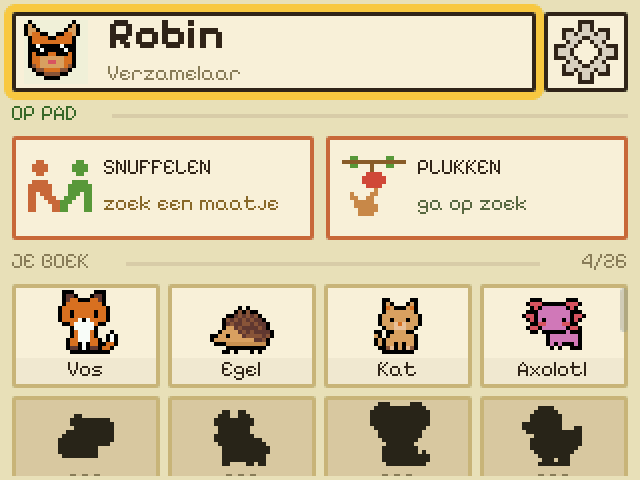
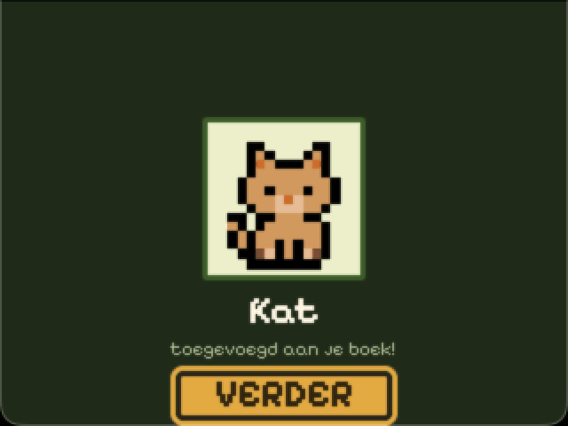

# PRD: Random visitors

**Status:** visual design brief

**Audience:** product/UI designer

**Platform:** 320 x 240 px badge app (reference exports are 640 x 480 at 2x)

## Summary

A creature can occasionally visit a **verzamelaar** who has not found enough
creatures through snuffelen or plukken. The visit is a gentle safety net: it
makes the badge feel alive and ensures that a child who plays mostly alone can
still build a small collection.

The player sees a persistent, in-app notification on the home screen, taps it,
greets the hidden creature, and receives one previously unknown base-tier
creature. There is no timer, cost, choice, failure state or way to miss the
visitor.

Randomness decides **when and which creature**, not whether an isolated player
gets to progress.

## Goals

- Give a WiFi-only player a collection floor of four creatures, including the
  startbeest, over a full camp weekend.
- Create a small moment of mystery and warmth when the badge is reopened.
- Complement snuffelen and plukken without making either activity feel
  unnecessary.
- Fit the existing pixel-art UI and positive-care philosophy.

## Non-goals

- This is not another hunt, trade, daily reward or push-notification system.
- Visitors do not award rare or legendary creatures; those remain reasons to
  explore, plukken, snuffelen and hunt.
- There is no feeding requirement, inventory cost, countdown or streak.
- This brief does not cover the server or scheduling implementation.

## Player rules

The system creates up to three visitor opportunities for a player who remains
a verzamelaar:

| Opportunity | Random window after registration | Only if collection has fewer than |
|---|---:|---:|
| First visitor | 2-4 hours | 2 creatures |
| Second visitor | 18-26 hours | 3 creatures |
| Third visitor | 38-48 hours | 4 creatures |

The windows are deliberately wide and seeded per player, so roughly 100 app
installs do not all receive the same event at once. They suit the expected
arrival pattern: late Thursday or Friday morning, with long gaps for workshops,
meals, sleep and the rest of camp.

- Eligibility is checked when each window arrives. Creatures already gained
  through snuffelen or plukken count, so active/social players naturally skip
  some or all visitors.
- New visitor opportunities are created only during the camp window, Thursday
  15:00 through Sunday 15:00. Do not compress the schedule for late installs.
- A due visitor waits indefinitely until the player returns. It does not expire
  at camp close.
- Only one visitor is visible at a time. Never stack notifications or present
  several reveals back-to-back.
- If the player becomes a jager, no new visits are scheduled, but an already
  waiting visitor remains available.
- The reward is one randomly selected, previously unknown base-tier creature.
  If its candidate was found elsewhere before the reveal, select another
  unknown base creature. Suppress the event if none remain.

With 100 installs, the absolute ceiling is 300 visitor rewards across 72 hours;
actual volume should be lower because plukken and snuffelen satisfy the same
collection thresholds.

## Visual flow

### 1. Home: a visitor is waiting

Show a noticeable but calm notification without obscuring **Snuffelen**,
**Plukken**, settings or the book. It must survive leaving and returning to the
home screen.

Suggested copy:

- Label: `BEZOEK!`
- Message: `Er ritselt iets bij je kamp...`
- Action: `GA KIJKEN`

The notification should feel intriguing, not urgent: no red warning treatment,
countdown, exclamation spam or "now" language. A leaf, rustling bush or pair of
eyes is a better motif than an alarm bell.

### 2. Visitor: greet the silhouette

Open a dedicated full-screen scene. A creature silhouette peeks from foliage or
a campsite edge. Keep enough of the silhouette hidden that the reveal still has
a payoff.

Suggested copy:

- Heading: `ER ZIT IETS IN DE STRUIKEN...`
- Supporting line: `Het lijkt op jou te wachten.`
- Action: `ZEG HALLO`

This is a single welcoming action. It must not consume food or ask the player to
make the right choice. On tap, briefly animate the foliage/silhouette and move
directly to the reveal. Do not auto-advance; a child may have put the badge down.

### 3. Reveal: the creature stays

Reveal the normal creature sprite and add it permanently to the book. Reuse the
calm creature-acquisition composition, but distinguish a visit from a hunt or a
legendary jackpot with soft forest greens, leaves and warm camp light.

Example copy for Kat:

- Heading: `KAT WIL BLIJVEN!`
- Supporting line: `toegevoegd aan je boek!`
- Action: `VERDER`

`VERDER` opens the new creature's detail screen, from which normal care actions
are available. The home book count and card update immediately.

## Interaction and motion notes

- One tap from notification to visitor scene, then one tap to reveal.
- Use the existing large, bordered primary-button pattern and visible focus
  treatment.
- A subtle two- or three-frame rustle, blink or leaf movement is enough. Avoid
  flashing, long blocking animation and legendary fireworks.
- A short friendly sound may accompany the reveal, using the normal base-creature
  celebration rather than the legendary fanfare.
- Keep all UI copy within ASCII 32-126: use `...`, not an ellipsis character;
  avoid accented letters, emoji and typographic punctuation.
- Meaning must not depend on colour alone, and copy should remain legible without
  animation or sound.

## Required design handoff

Please supply three annotated 320 x 240 frames plus 2x PNG exports:

1. Collector home with the waiting-visitor notification.
2. Visitor silhouette scene before `ZEG HALLO`.
3. Base-creature reveal after the tap.

Also show the focus/pressed treatment for each new button and note any small art
assets or animation frames needed. Design against the longest base-creature name
(`CAPYBARA`) as well as the short example (`KAT`).

## Existing visual references

These are implementation screenshots, exported at 2x:

- [Collector home](../server/static/screens/oppad.png) - hierarchy, cards and
  collection grid.
- [Plukken](../server/static/screens/plukken.png) - full-width action button,
  focus ring and green terrain palette.
- [Creature acquired](../server/static/screens/gevangen.png) - reveal composition
  and primary CTA. Use its structure, but make the visitor mood gentler and
  visibly distinct from a catch.
- [Creature detail](../server/static/screens/beest.png) - destination after the
  reveal.

## Acceptance criteria

- A player can understand from still frames that something friendly is waiting,
  that tapping is safe, and that the creature has joined their book.
- The flow contains no urgency, penalty, resource requirement or failure state.
- Core home navigation remains available while the notification waits.
- The reveal is celebratory but cannot be mistaken for a legendary find.
- All supplied layouts work at native 320 x 240 and with both short and long
  base-creature names.
